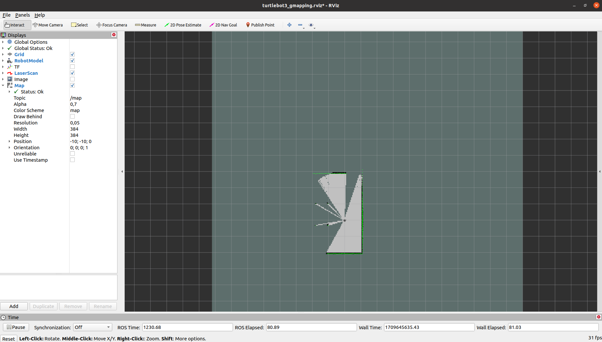
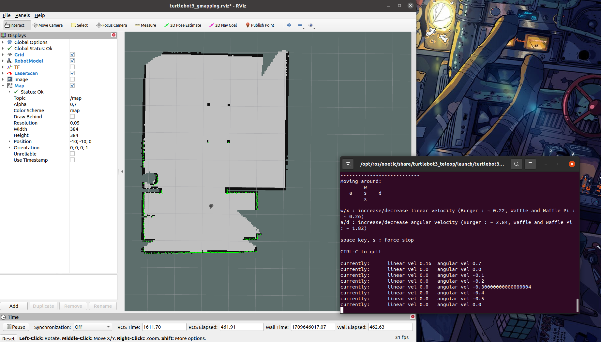
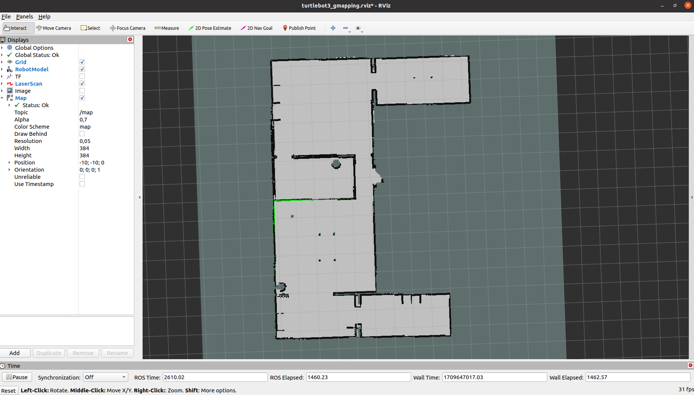
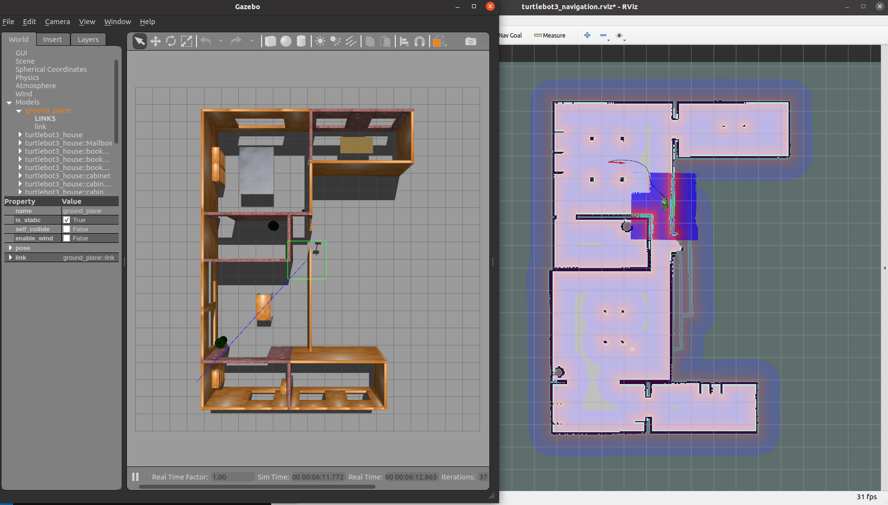

# GMAPPING

To run this algorithm, we will be using ROS Noetic running on Ubuntu 20.04.6 LTS.

## ENV Variables

Before running the instructions, in each new terminal that is open, you should run the following command:

```
export TURTLEBOT3_MODEL=burger
```

## Launching the simulation world

To launch the simulation world, you will need to type the following command:

```
roslaunch turtlebot3_gazebo turtlebot3_house.launch
```

You should be able to see the Gazebo simulation with the TurtleBot 3 house:


## Launching the SLAM node

Next, open a new terminal and launch the SLAM node that will run the Cartographer algorithm:

```
roslaunch turtlebot3_slam turtlebot3_slam.launch slam_methods:=gmapping
```

A new window of RVIZ running the Gmapping algorithm should be open, like this one:



## Launching the Teleoperation Node

Next you will need to open a teleoperation node to control the Turtlebot in the simulation.

```
roslaunch turtlebot3_teleop turtlebot3_teleop_key.launch
```

Control the robot to scan all rooms of the house. When you are ready, proceed to the next section to learn how to save the generated map.



## Saving the map

After scanning the environment, the results can be saved using the following command:

```
rosrun map_server map_saver -f ~/map
```

You should now have a map of the house, similar to this one:



## Launching the navigation node

Now we can use the generated map to navigate in the environment. To open the navigation node run the following commands:

```
roslaunch turtlebot3_navigation turtlebot3_navigation.launch map_file:=$HOME/map.yaml
```

PS. Remember to close all the other nodes and launch the simulation world again.

## Navigation pose 

Before starting to send navigation goals to your robot, first, you need to estimate the 2D pose of the TurtleBot. Click on the 2D pose estimation and place the arrow in the position of the robot with the correct orientation.

## Navigating in the environment

Now that the navigation node knows where the robot is, you can set navigation goals to make the robot navigate in the environment.

