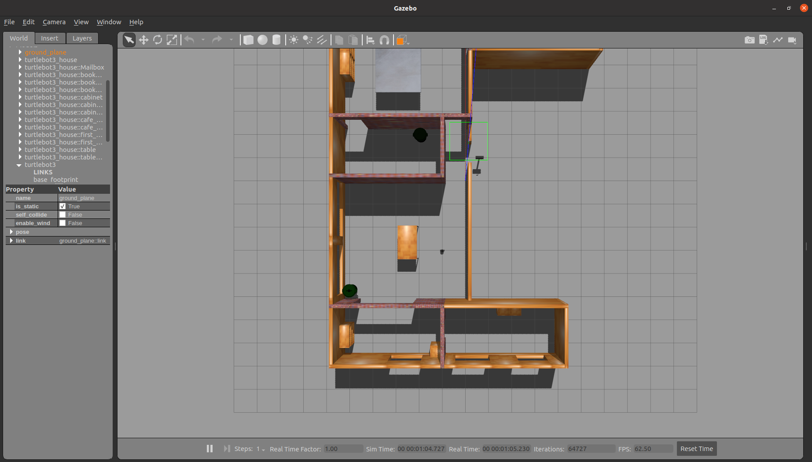
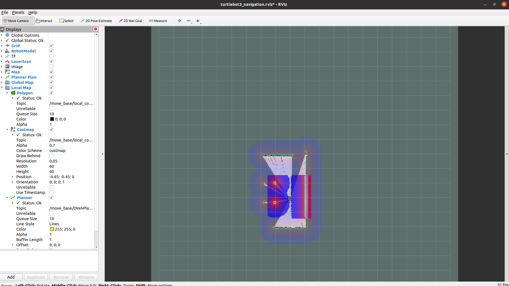
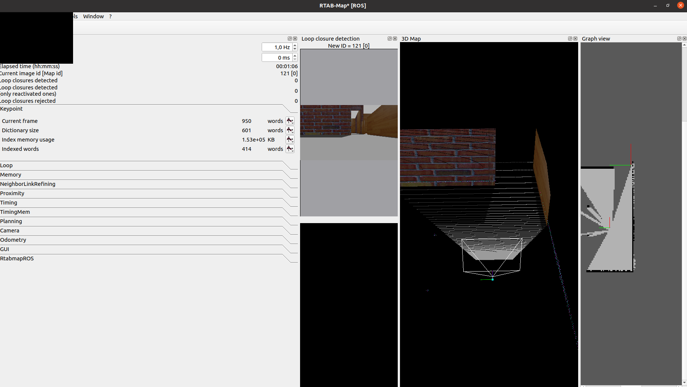
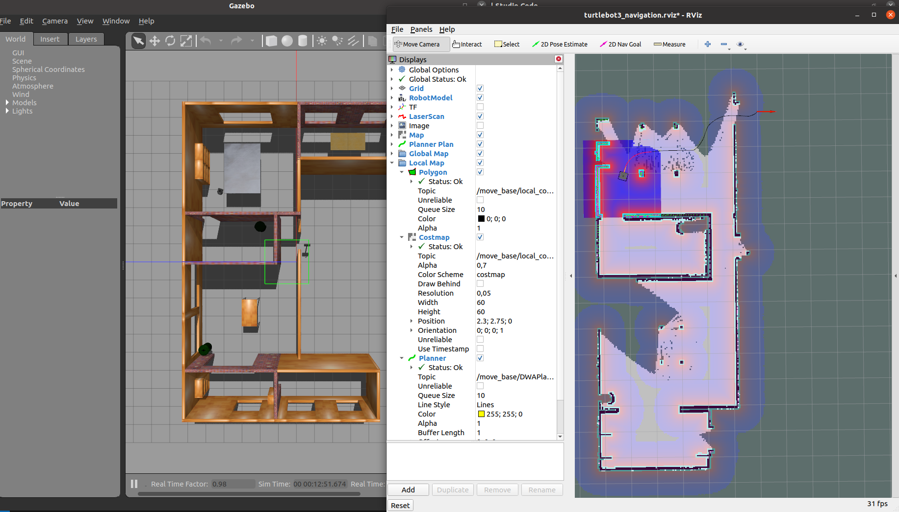

# RTAB-Map

To run this algorithm, we will be using ROS Noetic running on Ubuntu 20.04.6 LTS.

## Instalation

You will need to install a few packages to be able to run the RTAB-Map algorithm:

```
sudo apt install ros-noetic-rtabmap-demos ros-noetic-turtlebot3-simulations ros-noetic-turtlebot3-navigation ros-noetic-dwa-local-planner 
```

## ENV Variables

Before executing the instructions, in each new terminal that is open, you should run the following command:

```
export TURTLEBOT3_MODEL=waffle
```

## Launching the simulation world

To launch the simulation world, you will need to type the following command:

```
roslaunch turtlebot3_gazebo turtlebot3_house.launch
```

You should be able to see the Gazebo simulation with the TurtleBot 3 house:



## Launching the RTAB-Map demo

Open a new terminal and run the following command:

```
roslaunch rtabmap_demos demo_turtlebot3_navigation.launch
```

You should see a RVIZ window where you can set the navigation goals:



And a new window with the 3D map generated by the RTAB-Map and some information about the sensor of the Turtlebot:



## Navigating in the environment

Now you can keep setting navigation goals to map the whole environment:


And the RTAB-Map should also create a 3D map of the environment:


