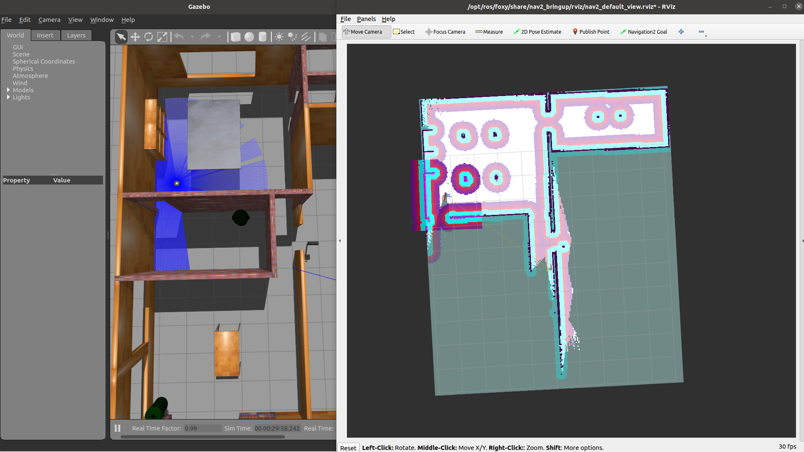

# Slam_Toolbox

To run this algorithm, we will be using ROS2 Foxy running on Ubuntu 20.04.6 LTS.

## ENV Variables

Before running the instructions, in each new terminal that is open, you should run the following command:

```
export TURTLEBOT3_MODEL=burger
```

## Launching the simulation world

To launch the simulation world, you will need to type the following command:

```
ros2 launch turtlebot3_gazebo turtlebot3_house.launch.py
```

You should be able to see the Gazebo simulation with the TurtleBot 3 house:


## Lauching RVIZ using nav2

Open a new terminal and run the following command:

```
ros2 launch nav2_bringup rviz_launch.py
```

## Lauching the navigation node

Run the following command in a new terminal:

```
ros2 launch nav2_bringup navigation_launch.py
```

## Lauching the slam_toolbox node

Run the following command in a new terminal:

```
ros2 launch slam_toolbox online_async_launch.py
```

## Navigating in the environment

After running the previous commands, you should have a screen nav2 window in RVIZ where you can set the navigation goals of the Turtlebot.


You can keep setting navigation goals to map the whole environment


